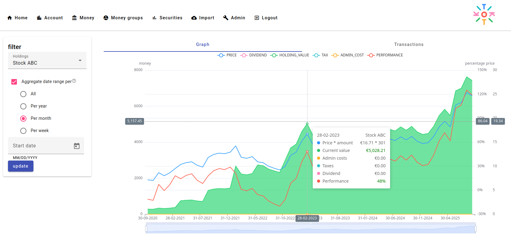

 
   
  
   
   

<h3 align="center">Self-hosted solution to gain insights into your wealth</h3>
 

 

## Disclaimer

- ⚠️ The project is under **very active** development.
- ⚠️ Expect bugs and breaking changes.
- ⚠️ Always follow [3-2-1](https://www.backblaze.com/blog/the-3-2-1-backup-strategy/) backup plan for your precious photos and videos!

>
> You can find the main documentation, including installation guides, at [tikito.org](https://tikito.org).

## Links

- [Documentation](https://tikito.org/docs/overview/welcome)

## Features

| Features                              | Supported   |
|:--------------------------------------|-------------|
| Import of stock transactions          | Yes         |
| Import of debit transactions          | Yes         |
| Retrieve security prices from Yahoo   | Yes         |
| Group your money transactions         | Yes         |
| Visualise your stock and money growth | Yes         |
| Loans, such as mortgages              | Comnig soon |
| Budgeting                             | Comnig soon |
| Backup and restore                    | Comnig soon |
| More options to import data           | Comnig soon |
| Manually add transactions             | Comnig soon |
| Translations                          | Comnig soon |

